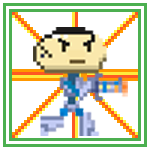
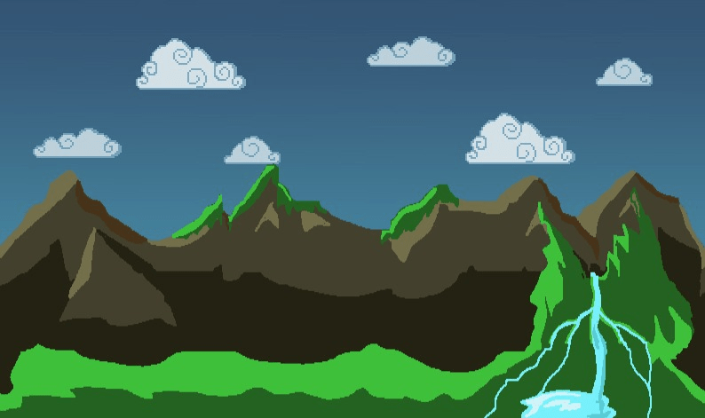
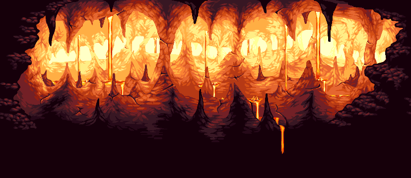

- Rodrigo Viladegut 51113
- Luciano Paniagua 52334

# Forest Survivor
## Videojuego desarrollado en el motor gráfico de godot para la materia de Infografía.

-----------------
## De que trata el Forest Survivor?
*Forest Survivor* es un juego de plataformas desarrollado por completo en el motod gráfico de Godot, en el cual, el principal objetivo es 
derrotar al malvado demonio, pasando antes por una serie de pruebas, como son los esbirros del malvado demonio, plataformas inestables y caídas libres.
Nuestro héroe deberá sobrevivir a estas pruebas, recogiendo monedas como incentivo, que lo ayudarán regenerando su vida.
Mucha suerte en esta aventura y esperemos la pueda completar de manera satisfactoria!

# Mucha suerte en tu travesía!

